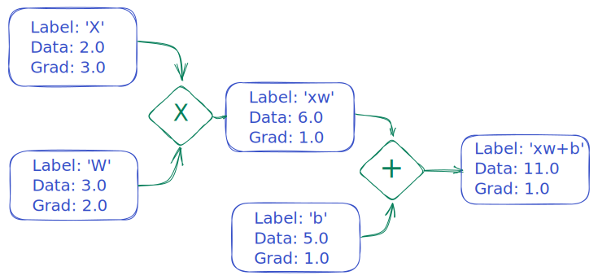

# Tensor-Lite

Tensor-Lite is a simple library for building and training machine learning models. It provides a simple and intuitive interface for building computational graphs and performing gradient-based optimization. It uses only native Python, without any dependencies on third-party libraries, making it easy to use and understand. Tensor-Lite was inspired by [micrograd](https://github.com/karpathy/micrograd) and is similar to libraries like [Autograd](https://github.com/HIPS/autograd) and [JAX](https://github.com/google/jax), but with a focus on simplicity and ease of use.

> **NOTE**
> Please note that Tensor-Lite is a hobby project and was created as an enjoyable learning exercise. It should not be used in production environments. For production machine learning projects, it is recommended to use a more robust and widely-used library such as [PyTorch](https://pytorch.org/), [JAX](https://github.com/google/jax), or [TensorFlow](https://www.tensorflow.org/).

## Features

- Pure native Python without any dependencies.
- Easy to use interface for building computational graphs.
- Automatic differentiation for gradient-based optimization.
- Supports linear regression, logistic regression, and neural networks and more.
- Gradient ascent and descent optimization methods included.

## Example usage

### Linear Function

Below is a simple example that demonstrates a linear function in Tensor-Lite along with a visualization of the data and grad that is generated:

```python
from tensor import Scalar

X = Scalar(2.0)
w = Scalar(3.0)
b = Scalar(5.0)

out = X * w + b
out.backward()
```



### Logistic Regression

Here is an example that demonstrates using Tensor-Lite to optimize a linear regression model:

```python
from tensor import Scalar

# Generate some sample data emulating the function y = 2x + 1
x = [1, 2, 3, 4, 5]
y = [3, 5, 7, 9, 11]

# Initialize the parameters
theta = [Scalar(0.0), Scalar(0.0)]

# Set the learning rate and the number of iterations
learning_rate = 0.01
num_iterations = 1000

# Train the model using gradient descent
for _ in range(num_iterations):
    # Construct the computational graph of the linear regression model and predict the output values using the learned parameters.
    w, b = theta
    y_predictions = [x * w + b for x in x]
    loss = sum((y_prediction - y_target) ** 2 for y_target, y_prediction in zip(y, y_predictions))
    # Compute the gradient of the loss function with respect to the parameters
    loss.backward()
    # Update the learnable parameters
    for param in theta:
        param.data -= learning_rate * param.grad
        param.grad = 0.0

# Print the learned parameters.
print("Learned parameters: ", theta)
```

## Example directory

The [example directory](./examples) contains a number of examples that demonstrate how to use Tensor-Lite to solve various machine learning problems, including linear regression, logistic regression, and neural networks.

## Contributions

We welcome contributions to Tensor-Lite! If you find a bug or would like to request a feature, please open an issue. If you would like to contribute code, please fork the repository and open a pull request.
